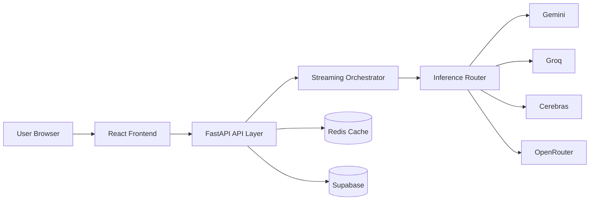
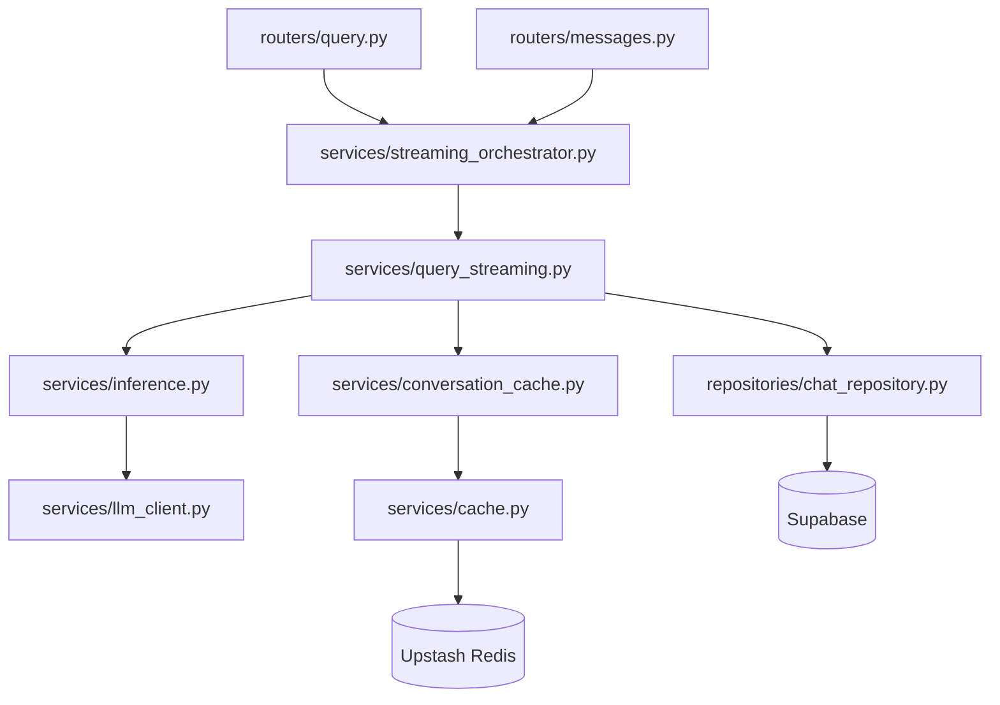
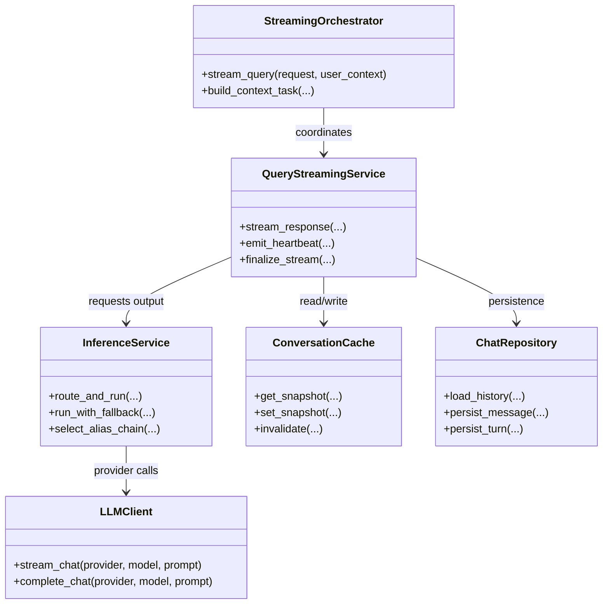
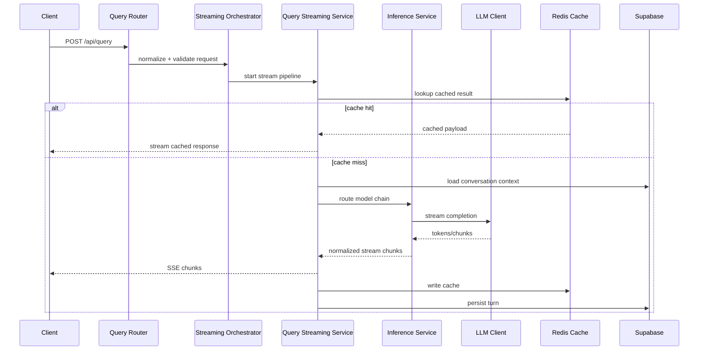

# KnowBear: Layered AI Knowledge Engine

KnowBear is a full-stack AI application that delivers explanations at the right depth for each user context, from beginner-friendly summaries to technical analysis.

It combines:

- A React + TypeScript frontend for chat, history, and mode selection.
- A FastAPI backend for orchestration, routing, streaming, and policy checks.
- Multi-provider LLM inference with fallback chains.
- Supabase for auth/data and Redis for caching and fast replay.

## Core Capabilities

- Multi-mode responses: `learning`, `technical`, `socratic`
- Layered output levels: `ELI5`, `ELI10`, `ELI12`, `ELI15`, `Meme`
- Intent-aware technical routing with depth adaptation
- SSE streaming responses with timeout guards and fail-soft fallback
- Conversation persistence and replay
- Export support for response artifacts (`.txt`, `.md`)

## Tech Stack

| Layer | Technologies |
|------|--------------|
| Frontend | React 18, TypeScript, Vite, Zustand, React Query, Tailwind CSS |
| Backend | FastAPI, Python 3.11+, Pydantic v2, Structlog |
| AI Providers | AsyncOpenAI-compatible clients, Gemini, Groq, Cerebras, OpenRouter |
| Data/Auth | Supabase |
| Cache | Upstash Redis |
| Testing | pytest, Vitest, Playwright |

## Repository Structure (ASCII)

```text
KnowBear/
|-- api/
|   |-- routers/          # HTTP routes and endpoint contracts
|   |-- services/         # inference, streaming, cache, auth, orchestration
|   |-- repositories/     # persistence abstraction
|   `-- tests/            # backend test suite
|-- src/
|   |-- components/       # UI building blocks
|   |-- pages/            # route-level UI
|   |-- stores/           # client state
|   `-- services/         # frontend API wrappers
|-- supabase/
|   `-- migrations/       # SQL migration history
|-- tests/
|   `-- e2e/              # browser-level end-to-end tests
`-- README.md
```

## High-Level Architecture



### Quick Runtime View (ASCII)

```text
+---------+      +-----------+      +-----------------+
| Browser | ---> | Frontend  | ---> | FastAPI Routers |
+---------+      +-----------+      +-----------------+
                                          |
                                          v
                                +----------------------+
                                | Streaming Orchestr.  |
                                +----------------------+
                                     |     |      |
                                     |     |      +--> Redis cache check
                                     |     +---------> Supabase history/context
                                     +--------------> Inference router -> LLM providers
```

## Low-Level Backend Architecture



## UML: Core Class Relationships



## UML: Sequence for `POST /api/query`



## Routing Model

KnowBear uses alias chains to decouple endpoint behavior from concrete provider IDs.
The backend selects an alias chain by mode and query characteristics, then attempts providers in order until one succeeds.

### LLM Routing Matrix (Mode x Query Characteristics)

| Mode | Query Characteristics | Ranked Alias Chain (first -> fallback) |
|------|------------------------|-----------------------------------------|
| `learning` | Freshness terms (`latest`, `today`, `recent`, `news`) | `learn-gemini-flash` -> `learn-groq-llama8b` -> `learn-openrouter-free` |
| `learning` | Short query (`<8` tokens) or latency-biased request | `learn-groq-llama8b` -> `learn-gemini-flash` -> `learn-openrouter-free` |
| `learning` | Default learning query | `learn-gemini-flash` -> `learn-groq-llama8b` -> `learn-openrouter-free` |
| `technical` | Math-heavy and high complexity (`>=0.6`) | `technical-gemini-pro` -> `technical-cerebras-glm` -> `technical-groq-llama8b` -> `technical-openrouter-free` |
| `technical` | Math-heavy and low complexity (`<0.4`) | `technical-gemini-flash` -> `technical-groq-llama8b` -> `technical-openrouter-free` |
| `technical` | Programming query or context-augmented technical query | `technical-gemini-pro` -> `technical-groq-llama8b` -> `technical-openrouter-free` |
| `technical` | Default technical query | `technical-gemini-pro` -> `technical-groq-llama8b` -> `technical-openrouter-free` |
| `socratic` | Default Socratic conversation | `socratic-openrouter-free` -> `socratic-gemini-pro` -> `socratic-groq-llama8b` |
| `socratic` | High-reasoning query with elevated complexity (`>=0.8`) | `socratic-cerebras-glm` -> `socratic-openrouter-free` -> `socratic-gemini-pro` -> `socratic-groq-llama8b` |

### Alias-to-Provider Matrix (Provider Model Fallback)

| Alias | Provider Fallback Order (`provider:model`) |
|------|---------------------------------------------|
| `learn-gemini-flash` | `gemini:gemini-2.5-flash` -> `groq:llama-3.1-8b-instant` -> `openrouter:openrouter/free` |
| `learn-groq-llama8b` | `groq:llama-3.1-8b-instant` -> `gemini:gemini-2.5-flash` -> `openrouter:openrouter/free` |
| `learn-openrouter-free` | `openrouter:openrouter/free` -> `gemini:gemini-2.5-flash` -> `groq:llama-3.1-8b-instant` |
| `technical-gemini-flash` | `gemini:gemini-2.5-flash` -> `groq:llama-3.1-8b-instant` -> `openrouter:openrouter/free` |
| `technical-gemini-pro` | `gemini:gemini-2.5-pro` -> `groq:llama-3.1-8b-instant` -> `openrouter:openrouter/free` |
| `technical-groq-llama8b` | `groq:llama-3.1-8b-instant` -> `gemini:gemini-2.5-pro` -> `openrouter:openrouter/free` |
| `technical-openrouter-free` | `openrouter:openrouter/free` -> `gemini:gemini-2.5-pro` -> `groq:llama-3.1-8b-instant` |
| `technical-cerebras-glm` | `cerebras:zai-glm-4.7` -> `gemini:gemini-2.5-pro` -> `groq:llama-3.1-8b-instant` |
| `socratic-openrouter-free` | `openrouter:cognitivecomputations/dolphin-mistral-24b-venice-edition:free` |
| `socratic-gemini-pro` | `gemini:gemini-2.5-pro` -> `groq:llama-3.1-8b-instant` -> `openrouter:openrouter/free` |
| `socratic-groq-llama8b` | `groq:llama-3.1-8b-instant` -> `gemini:gemini-2.5-pro` -> `openrouter:openrouter/free` |
| `socratic-cerebras-glm` | `cerebras:zai-glm-4.7` -> `gemini:gemini-2.5-pro` -> `groq:llama-3.1-8b-instant` -> `openrouter:openrouter/free` |

## Public API Surface

| Method | Path | Purpose |
|------|------|---------|
| `GET` | `/api/health` | Basic service availability |
| `GET` | `/api/pinned` | Curated topic feed |
| `POST` | `/api/query` | Main query execution |
| `POST` | `/api/export` | Export generated response |
| `GET` | `/api/usage` | User plan/usage view |

## Request and Event Shapes

### JSON Request Example (`/api/query`)

```json
{
  "prompt": "Explain consensus algorithms with a practical analogy",
  "mode": "technical",
  "level": "ELI12",
  "conversation_id": "9e8f8b9c-56ad-4738-95f8-8f63f83c2f65",
  "stream": true
}
```

### JSON Streaming Event Example (SSE chunk)

```json
{
  "type": "chunk",
  "token": "Raft",
  "position": 18,
  "done": false
}
```

## XML Examples

The following XML snippets are integration-oriented examples for teams that exchange config or response metadata in XML.

### XML Provider Chain Configuration

```xml
<?xml version="1.0" encoding="UTF-8"?>
<routing profile="technical-default" version="1">
  <mode name="technical"/>
  <aliases>
    <alias rank="1" id="technical-gemini-pro"/>
    <alias rank="2" id="technical-groq-llama8b"/>
    <alias rank="3" id="technical-openrouter-free"/>
  </aliases>
  <streaming heartbeatSeconds="2" startTimeoutSeconds="20" maxDurationSeconds="25"/>
</routing>
```

### XML Prompt Policy Structure

```xml
<?xml version="1.0" encoding="UTF-8"?>
<promptPolicy mode="socratic" level="ELI10">
  <behavior>
    <askFollowUp>true</askFollowUp>
    <directAnswer>false</directAnswer>
  </behavior>
  <constraints>
    <maxTokens>800</maxTokens>
    <citeWhenAvailable>true</citeWhenAvailable>
  </constraints>
</promptPolicy>
```

### XML Conversation Export Example

```xml
<?xml version="1.0" encoding="UTF-8"?>
<conversation id="9e8f8b9c-56ad-4738-95f8-8f63f83c2f65" mode="learning">
  <message role="user" at="2026-04-16T10:22:58Z">What is eventual consistency?</message>
  <message role="assistant" at="2026-04-16T10:23:04Z">Eventual consistency means replicas converge over time...</message>
</conversation>
```

## Local Development

Prerequisites:

- Node.js 18+
- Python 3.11+

### Backend

```bash
python3 -m venv .venv
npm run api:install
cp .env.example .env
npm run api:dev
```

### Frontend

```bash
npm install
npm run dev
```

### Full Stack

```bash
npm run dev:full
```

## Testing

```bash
npm run lint
npm run type-check
CI=1 npm run test
npm run test:smoke
npm run api:test
```

## Database Migrations

```bash
npx supabase migration up
```

Migration helper:

```bash
.venv/bin/python scripts/migrate_v1_to_v2_history.py
```

## Contributing

Please open an issue for major changes, then submit a focused PR with tests.

## License

Apache License 2.0
