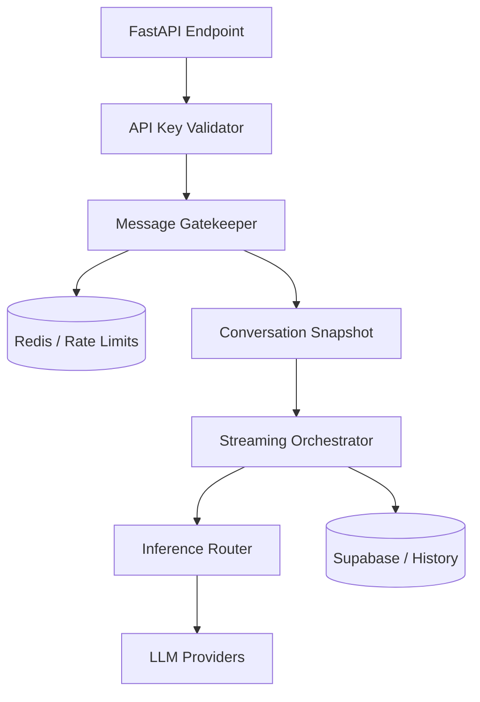

# DepthAPI: Headless Contextual AI Engine

DepthAPI is a high-performance B2B AI orchestration engine designed to deliver explanations at the precise depth required for any professional context—from simplified executive summaries to deep technical audits.

Originally built as KnowBear, an AI-powered layered learning engine web-app, DepthAPI has evolved into a fully headless service layer optimized for multi-tenant integration and programmatic scaling.

## Core Capabilities

- **Layered Knowledge Retrieval**: Delivers content across standardized depth levels (`ELI5`, `ELI15`, `Technical`, etc.).
- **Headless Orchestration**: Native support for API-only workflows with no frontend overhead.
- **Project-Scoped Memory**: Multi-tenant conversation persistence and project-level context management.
- **Streaming Reliability**: Production-grade SSE streaming with automatic heartbeats, timeout guards, and fail-soft fallback chains.
- **Provider Agnostic**: Unified interface for OpenAI, Gemini, Groq, Cerebras, and OpenRouter with dynamic failover routing.

## Tech Stack

| Layer | Technologies |
|------|--------------|
| **Backend** | FastAPI, Python 3.11+, Pydantic v2, Structlog |
| **Authentication** | API Key-based (SHA-256 hashed), scoped to plan metadata |
| **Persistence** | Supabase (PostgreSQL), pgvector (RAG ready) |
| **Speed/Concurrency** | Upstash Redis (Caching, Rate Limiting, Idempotency) |
| **Inference** | LiteLLM-compatible multi-provider routing |

## Architecture



## Authentication

DepthAPI uses the `X-API-Key` header for authentication. 

```bash
curl -X POST "https://api.depthapi.com/v1/query" \
     -H "X-API-Key: sk-depth-your-key-here" \
     -H "Content-Type: application/json" \
     -d '{"topic": "Quantum Computing", "mode": "technical"}'
```

Keys are stored as SHA-256 digests. Plan-based rate limits and token budgets are enforced dynamically at the project level.

## Repository Structure

```text
DepthAPI/
|-- api/
|   |-- routers/          # API endpoints (messages, query, payments, webhooks)
|   |-- services/         # Core logic (auth, streaming, inference, rate limiting)
|   |-- repositories/     # Database abstractions
|   `-- tests/            # Backend test suite
|-- supabase/
|   `-- migrations/       # SQL schema and B2B transition history
|-- scripts/              # Utility scripts for migration and maintenance
`-- README.md
```

## Local Development

### Prerequisites
- Python 3.11+
- Redis (Local or Upstash)
- Supabase Instance

### Backend Setup
1. Clone the repository.
2. Create a virtual environment: `python -m venv .venv`.
3. Install dependencies: `pip install -r api/requirements.txt`.
4. Copy `.env.example` to `.env` and fill in credentials.
5. Start the dev server: `uvicorn main:app --reload`.

## Testing
Run the comprehensive backend test suite:
```bash
pytest api/tests
```

## License
Apache License 2.0
