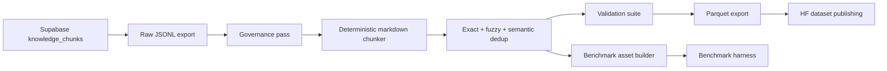

# Research Corpus Architecture

## Stages

1. `crawl`: export chunk-bearing source documents from Supabase into a reproducible JSONL snapshot.
2. `governance`: generate mixed-license manifests and preserve per-source attribution.
3. `chunk`: run deterministic heading-aware markdown chunking with code fence preservation.
4. `dedup`: remove exact, fuzzy, and semantic duplicates with explicit reporting.
5. `validate`: flag malformed UTF-8, markdown corruption, pathological lengths, and boilerplate.
6. `export`: emit parquet suitable for HF datasets and downstream retrieval benchmarks.
