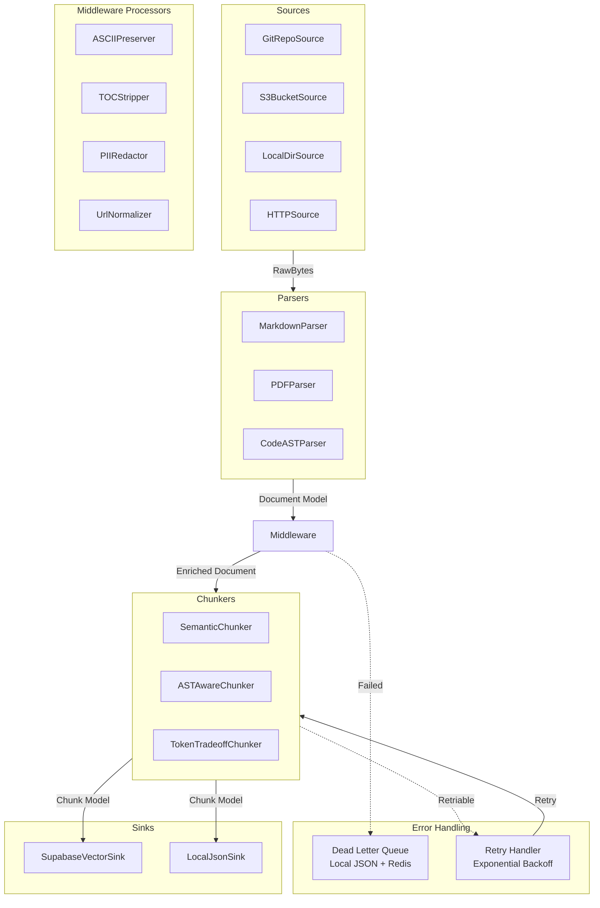

# Enterprise RAG Ingestion Pipeline: Architecture & Implementation Plan (Refined)

## Executive Summary

Transition DepthAPI from scattered, dataset-specific ingestion scripts (`ingest_system_design_primer.py`, `ingest_dlwp.py`, etc.) to a **Declarative, Plugin-Based Pipeline Architecture**. Instead of writing a new Python script for every dataset, developers will write a YAML configuration file. The engine dynamically assembles the required adapters, parsers, and middleware to process data.

**Key Outcomes:**
- Eliminate copy-paste ingestion code.
- Make new datasets easy to add (YAML config only).
- Clarify the moat: curation logic + pipeline, not raw data.
- Enable safe open-source data release (chunks on HuggingFace, keep curation private).

---

## 1. Core Architecture: The DAG

The pipeline is organized as a Directed Acyclic Graph (DAG) of interchangeable components. Data flows through strict contracts defined by **Pydantic models**.



---

## 2. Standardized Data Contracts

Every component communicates via strict Pydantic models. This ensures data provenance and lineage are tracked natively.

```python
from pydantic import BaseModel, HttpUrl, Field
from typing import Any, Dict, List, Optional
from datetime import datetime

class Document(BaseModel):
    """Raw document from source."""
    doc_id: str
    source_uri: str
    raw_content: bytes
    mime_type: str
    metadata: Dict[str, Any] = Field(default_factory=dict)
    retrieved_at: datetime = Field(default_factory=datetime.utcnow)

class ParsedDocument(Document):
    """Document after parsing and middleware."""
    markdown_content: str
    extraction_confidence: float
    
    # Lineage tracking (critical for reproducibility)
    pipeline_version: str  # e.g., "v1.2.0"
    dataset_version: str   # e.g., "system-design-primer-v2"
    applied_middleware: List[str]  # e.g., ["TocStripper", "AsciiDiagramPreserver"]
    middleware_hash: str  # SHA-256 of middleware params for reproducibility
    parsing_duration_ms: float

class Chunk(BaseModel):
    """Final chunked unit for ingestion."""
    chunk_id: str
    doc_id: str
    content: str
    token_count: int
    metadata: Dict[str, Any] = Field(default_factory=dict)
    
    # Lineage (critical for open-source dataset provenance)
    pipeline_version: str
    dataset_version: str
    source_name: str  # e.g., "System Design Primer"
    source_url: Optional[str]
    chunk_order: int
    content_hash: str  # SHA-256 for deduplication
    created_at: datetime = Field(default_factory=datetime.utcnow)

class ErrorRecord(BaseModel):
    """Dead Letter Queue entry."""
    error_id: str
    severity: str  # "WARN" | "ERROR" | "FATAL"
    classification: str  # e.g., "token_count_too_low", "extraction_failed"
    action: str  # e.g., "skip_chunk", "skip_document", "retry"
    retryable: bool
    attempted_at: datetime
    max_retries: int
    retry_count: int = 0
    original_doc: Document
    error_message: str
    traceback: Optional[str]
```

---

## 3. Plugin Interfaces

Every stage of the pipeline must implement a base interface. This allows you to extract complex logic from existing scripts into reusable classes.

### A. Source

```python
from abc import ABC, abstractmethod
from typing import Iterator

class BaseSource(ABC):
    """Fetch raw documents from external source."""
    
    @abstractmethod
    def fetch(self) -> Iterator[Document]:
        """Yields raw Document objects."""
        pass

    @abstractmethod
    def validate_config(self, config: Dict[str, Any]) -> bool:
        """Validate source configuration."""
        pass
```

### B. Parsers

Parsers convert raw bytes into standard Markdown.

```python
class BaseParser(ABC):
    """Parse raw bytes into Markdown."""
    
    @abstractmethod
    def parse(self, doc: Document) -> ParsedDocument:
        pass
    
    @abstractmethod
    def supports_mime_type(self, mime_type: str) -> bool:
        pass
```

### C. Middleware (The Secret Sauce)

Middleware applies domain-specific heuristics (ASCII diagram detection, TOC removal, etc.).

```python
class BaseMiddleware(ABC):
    """Apply domain-specific transformations to parsed documents."""
    
    @abstractmethod
    def process(self, doc: ParsedDocument) -> ParsedDocument:
        """Transform document. Must be idempotent."""
        pass
    
    @abstractmethod
    def name(self) -> str:
        """Unique middleware identifier for lineage tracking."""
        pass
    
    def config_hash(self, config: Dict[str, Any]) -> str:
        """SHA-256 of config for reproducibility."""
        import hashlib
        import json
        return hashlib.sha256(json.dumps(config, sort_keys=True).encode()).hexdigest()

# Example extracted from your current scripts:
class AsciiDiagramPreserver(BaseMiddleware):
    """Detect and preserve ASCII diagrams in markdown."""
    
    def __init__(self, config: Dict[str, Any]):
        self.config = config
        # Your regex logic here
    
    def process(self, doc: ParsedDocument) -> ParsedDocument:
        # Your existing regex to detect and wrap ascii boxes in ```diagram fences
        # Must preserve doc.pipeline_version, doc.applied_middleware, etc.
        doc.applied_middleware.append(self.name())
        return doc
    
    def name(self) -> str:
        return "AsciiDiagramPreserver"
```

### D. Chunkers

Chunkers split the `ParsedDocument` into `Chunk` objects, respecting token limits.

```python
class BaseChunker(ABC):
    """Split parsed documents into chunks."""
    
    @abstractmethod
    def chunk(self, doc: ParsedDocument, max_tokens: int = 480) -> List[Chunk]:
        pass
    
    @abstractmethod
    def name(self) -> str:
        pass
```

### E. Sink

```python
class BaseSink(ABC):
    """Persist chunks to storage (database, JSON file, etc.)."""
    
    @abstractmethod
    def write(self, chunks: List[Chunk]) -> int:
        """Write chunks. Return number of chunks written."""
        pass
    
    @abstractmethod
    def validate_chunk(self, chunk: Chunk) -> bool:
        """Validate chunk before write (e.g., token count, content hash)."""
        pass
```

---

## 4. Configuration-Driven Execution

Datasets are no longer defined by Python scripts. They are defined by YAML configs. The Orchestrator engine reads this config and builds the pipeline dynamically.

### A. Configuration Schema

**`datasets/system_design_primer/config.yaml`**

```yaml
name: "System Design Primer"
version: "v1.0"  # Dataset version for lineage
description: "System design interview prep guide"

source:
  type: "GitRepoSource"
  repo_url: "https://github.com/donnemartin/system-design-primer"
  branch: "master"
  include: ["*.md", "solutions/**/*.py"]
  timeout_seconds: 300

routing:
  - mime_type: "text/markdown"
    parser: "MarkdownParser"
    middleware:
      - name: "TocStripper"
        config:
          depth: 3
      - name: "AsciiDiagramPreserver"
        config:
          preserve_box_drawings: true
      - name: "UrlNormalizer"
        config: {}
    chunker:
      name: "SemanticChunker"
      config:
        max_tokens: 480
        min_tokens: 50
  
  - mime_type: "text/x-python"
    parser: "CodeASTParser"
    middleware: []
    chunker:
      name: "ASTAwareChunker"
      config:
        max_tokens: 512
        preserve_function_context: true

sink:
  type: "SupabaseVectorSink"
  config:
    table: "knowledge_chunks"
    collection_name: "System Design Primer"
    dedup_strategy: "upsert"  # upsert | skip_duplicate | merge
    upsert_key: ["document_id", "chunk_order", "content_hash"]

error_handling:
  token_count_too_low:
    severity: "WARN"
    action: "skip_chunk"
    dlq: true
    retry: false
  
  extraction_failed:
    severity: "ERROR"
    action: "skip_document"
    dlq: true
    retry: true
    max_retries: 3
  
  duplicate_content_hash:
    severity: "INFO"
    action: "skip_chunk"
    dlq: false
    retry: false

observability:
  log_level: "INFO"
  emit_metrics: true
  metrics_prefix: "depthapi.ingest"
```

### B. Configuration Validation

```python
from pydantic import BaseModel, validator
from typing import Dict, List, Any

class RoutingConfig(BaseModel):
    mime_type: str
    parser: str
    middleware: List[Dict[str, Any]]
    chunker: Dict[str, Any]
    
    @validator('mime_type')
    def validate_mime_type(cls, v):
        if not isinstance(v, str) or '/' not in v:
            raise ValueError(f"Invalid MIME type: {v}")
        return v

class DatasetConfig(BaseModel):
    name: str
    version: str
    source: Dict[str, Any]
    routing: List[RoutingConfig]
    sink: Dict[str, Any]
    error_handling: Dict[str, Any]
    
    class Config:
        extra = "forbid"  # Enforce schema strictly
```

---

## 5. Error Classification & Idempotency Strategy

### A. Error Types & Handling

| Classification | Severity | Action | DLQ | Retryable | Details |
|---|---|---|---|---|---|
| `token_count_too_low` | WARN | skip_chunk | Yes | No | Chunk has <50 tokens after cleaning. |
| `token_count_too_high` | WARN | skip_chunk | Yes | No | Chunk would exceed max_tokens even with splitting. |
| `extraction_failed` | ERROR | skip_document | Yes | Yes (3x) | Parser failed; retry up to 3 times. |
| `duplicate_content_hash` | INFO | skip_chunk | No | No | Chunk already in DB; use `upsert` strategy. |
| `pii_detected` | ERROR | redact_and_continue | Yes | No | Middleware detected PII; redact and log. |
| `validation_failed` | ERROR | skip_document | Yes | No | Final chunk validation failed (e.g., invalid JSON in metadata). |
| `sink_connection_error` | ERROR | retry | Yes | Yes (5x) | Database connection lost; retry with backoff. |

### B. Idempotency Guarantees

1. **Document-level idempotency**: If a document is reprocessed, use SHA-256 of source content as `doc_id`. Same source → same ID → same chunks.
2. **Chunk-level deduplication**: Always upsert on `(document_id, chunk_order, content_hash)` to prevent duplicates.
3. **Middleware idempotency**: All middleware MUST be idempotent. Running `AsciiDiagramPreserver` twice should produce identical output. Enforce with unit tests.
4. **Retry safety**: Retry handler uses idempotent task IDs. Never retry without checking if the chunk already exists in the sink.

```python
# Example: Idempotent sink write
def write_chunks(self, chunks: List[Chunk]) -> int:
    """Write chunks, upsert on dedup key."""
    upsert_key = ["document_id", "chunk_order", "content_hash"]
    
    for chunk in chunks:
        if not self.validate_chunk(chunk):
            # Log and skip invalid chunks
            continue
        
        # Upsert: if chunk with same key exists, update; else insert
        result = self.db.table("knowledge_chunks").upsert(
            chunk.dict(),
            on_conflict=",".join(upsert_key)
        ).execute()
        
        if result.error:
            raise SinkWriteError(f"Upsert failed: {result.error}")
    
    return len(chunks)
```

---

## 6. Concurrency & Scale Guardrails

### A. Connection Pooling

```python
# In SupabaseVectorSink
from sqlalchemy import create_engine
from sqlalchemy.pool import QueuePool

engine = create_engine(
    database_url,
    poolclass=QueuePool,
    pool_size=10,           # Steady-state connections
    max_overflow=5,         # Temporary overflow
    pool_timeout=30,        # Wait up to 30s for connection
    pool_recycle=3600,      # Recycle every hour
)
```

### B. Rate Limiting & Backpressure

```python
import asyncio
from typing import Semaphore

class PipelineOrchestrator:
    def __init__(self, max_concurrent_docs: int = 50):
        self.semaphore = asyncio.Semaphore(max_concurrent_docs)
        self.rate_limiter = RateLimiter(max_docs_per_sec=10)
    
    async def process_document(self, doc: Document):
        async with self.semaphore:
            await self.rate_limiter.acquire()
            # Process document
            pass
```

### C. Idempotent Task IDs (Celery)

```python
from celery import Celery

# If using Celery for distributed processing
@app.task(bind=True)
def ingest_document(self, doc_id: str):
    """Idempotent task using doc_id."""
    # Celery will deduplicate retries based on task_id
    # Which we set to doc_id for true idempotency
    pass

# Queue task with deterministic ID
app.send_task(
    'ingest_document',
    args=(doc_id,),
    task_id=f"ingest_{doc_id}",  # Deterministic → idempotent
)
```

---

## 7. Lineage Tracking & Reproducibility

Every chunk includes:
- `pipeline_version`: The version of the framework used.
- `dataset_version`: The version of the dataset configuration.
- `middleware_hash`: SHA-256 of applied middleware configs.
- `source_uri`: Where the data came from.

This enables:
1. **Dataset versioning**: Rebuild a dataset with the same pipeline → identical chunks (or close).
2. **Audit trail**: Know exactly what processing was applied to each chunk.
3. **Quality comparisons**: Compare chunk quality across pipeline versions.
4. **Reproducible open-source release**: Publish chunks + lineage metadata; users can validate.

```python
# Query all chunks for a dataset version
chunks = db.table("knowledge_chunks").select("*").eq(
    "dataset_version", "system-design-primer-v2"
).execute()

# All chunks have identical middleware_hash → reproducible
assert all(c["middleware_hash"] == chunks[0]["middleware_hash"] for c in chunks)
```

---

## 8. Implementation Plan (Refined)

### Phase 0: Testing Foundation (Week 1)
**Goal**: De-risk refactoring by establishing test coverage for existing code.

**Deliverables**:
1. Unit tests for `base_ingestor.py` (token counting, deduplication, chunking).
2. Unit tests for `semantic_chunker.py` (splitting logic).
3. Fixtures: sample markdown, code files, and expected chunk output.
4. Define Pydantic models (`Document`, `ParsedDocument`, `Chunk`, `ErrorRecord`).
5. Validator for YAML configs.

**Key artifact**: `tests/unit/test_existing_ingestion.py` (all green before proceeding).

---

### Phase 1: Core Framework (Week 2)
**Goal**: Build the orchestration engine without modifying existing code yet.

**Deliverables**:
1. Abstract base classes (`BaseSource`, `BaseParser`, `BaseMiddleware`, `BaseChunker`, `BaseSink`).
2. `PipelineOrchestrator` class that reads YAML and instantiates plugins (Factory pattern + `entry_points`).
3. Error handler with DLQ support (local JSON + optional Redis).
4. Telemetry integration (structlog, metrics emitter).

**Key artifact**: `api/services/rag/pipeline/orchestrator.py` with full docstrings and type hints.

---

### Phase 2: Refactor Existing Logic (Weeks 3–4)
**Goal**: Extract hard-coded logic from existing scripts into reusable plugins.

**Deliverables**:
1. Extract BAAI token counting → `TokenCounter` utility (reusable).
2. Extract ASCII diagram regex → `AsciiDiagramPreserver` middleware.
3. Extract Markdown AST/header splitting → `SemanticChunker` class.
4. Adapt `base_ingestor.py` → `SupabaseVectorSink` or `LocalJsonSink`.
5. Refactor existing ingesters (`ingest_system_design_primer.py`, etc.) into YAML configs.

**Validation**: Run Phase 0 tests on all refactored components. Output must match pre-refactor.

**Key artifact**: `datasets/*/config.yaml` for each existing dataset.

---

### Phase 3: Observability & Resilience (Week 5)
**Goal**: Production-grade monitoring, error handling, and lineage tracking.

**Deliverables**:
1. Dead Letter Queue support (local JSON, optional Redis/Upstash backend).
2. Retry handler with exponential backoff (3–5 attempts, configurable).
3. Structured logging (JSON output, correlation IDs).
4. Metrics: docs processed, chunks generated, errors by type, latency percentiles (p50, p95, p99).
5. Error classification table enforcement (skip vs. retry vs. fatal).

**Key artifact**: `api/services/rag/pipeline/error_handler.py` and observability module.

---

### Phase 4: Concurrency & Scale (Week 6)
**Goal**: Enable efficient multi-document processing without resource exhaustion.

**Deliverables**:
1. Async/Celery wrapper around orchestrator.
2. Connection pooling (Supabase sink: pool_size=10, max_overflow=5).
3. Rate limiting (e.g., max 10 docs/sec from external sources).
4. Semaphore for bounded concurrency (e.g., 50 concurrent documents).
5. Integration tests: process 1000 documents, verify no connection exhaustion.

**Key artifact**: `api/services/rag/pipeline/concurrent_orchestrator.py`.

---

### Phase 5: Testing & Validation (Week 7)
**Goal**: Comprehensive test coverage before production deployment.

**Deliverables**:
1. Unit tests for all plugins (source, parser, middleware, chunker, sink).
2. Integration tests: YAML config → output chunks (end-to-end).
3. Regression tests: reingesting a dataset produces identical chunks to Phase 2.
4. Stress tests: 1000+ documents, verify latency and accuracy.
5. Documentation: YAML schema, plugin development guide, troubleshooting.

**Key artifact**: `tests/integration/test_pipeline_e2e.py`.

---

## 9. How This Addresses the Moat Question

By systematizing ingestion and curation, this plan clarifies what's defensible:

| Asset | Moat Strength | Action | Reasoning |
|---|---|---|---|
| **Raw chunks (239K+)** | **Weak** | ✅ Publish on HuggingFace (filtered by license) | Data is commodity; reproducible from source docs. |
| **Embeddings (768-dim vectors)** | **Weak** | Don't publish | Model-specific, reproducible, derivative. |
| **FAISS index** | **Ultra-weak** | Don't publish | Implementation artifact; rebuild from chunks anytime. |
| **Pipeline framework code** | **Medium** | ✅ Publish (generic framework, not configs) | Open-source the framework; keep heuristics private. |
| **Curation configs (YAML)** | **Strong** | 🔒 Keep private | ASCIIDiagramPreserver rules, TOC patterns, chunk size tuning = domain knowledge. |
| **Ingestion heuristics + ML tuning** | **Strong** | 🔒 Keep private | Continuous improvement of middleware, chunker tuning, deduplication strategy. |

**Value Proposition for Open-Source**:
- Publish: `ENTERPRISE_RAG_PIPELINE_PLAN.md`, framework code (`api/services/rag/pipeline/`), generic plugins.
- Publish: `data/rag/trusted/chunks.json` (on HuggingFace, filtered for license compliance).
- Keep Private: Dataset configs (`datasets/*/config.yaml`), custom middleware logic, embedding strategies.

This positions you as **"The company that built the infrastructure to handle massive RAG reliably"** rather than **"We have a proprietary dataset."** Much stronger narrative for open-source.

---

## 10. Success Criteria

By end of Phase 5:
- [ ] All existing ingestion scripts replaced by YAML configs.
- [ ] New dataset can be added + processed in <30 minutes (YAML only, no Python coding).
- [ ] 100% of existing chunks reproduced bit-for-bit after refactoring (regression tests pass).
- [ ] DLQ contains <1% of documents (error rate acceptable).
- [ ] Latency for 1000-document ingest: <2 hours (@50 concurrent, @10 docs/sec limit).
- [ ] Framework code open-sourceable; no hardcoded secrets or proprietary logic.
- [ ] Lineage tracking enables reproducible dataset versioning for open-source release.

---

## 11. Risk Mitigation

| Risk | Likelihood | Mitigation |
|---|---|---|
| Phase 2 refactoring breaks existing pipelines | **Medium** | Phase 0 tests + regression validation before shipping. |
| YAML configs become hard to maintain | **Low** | Schema validation + CI checks; limit to 1 YAML per dataset. |
| Concurrency introduces race conditions | **Medium** | Phase 4 stress tests + idempotency guarantees. |
| DLQ grows unbounded | **Low** | Set max size + auto-archive old entries. |
| Lineage tracking adds overhead | **Low** | Hash computation is O(1); lineage is stored, not computed per query. |

---

## 12. Timeline Summary

| Phase | Week | Duration | Risk | Effort |
|---|---|---|---|---|
| Phase 0: Testing | W1 | 1 week | Low | Medium |
| Phase 1: Framework | W2 | 1 week | Low | Medium |
| Phase 2: Refactor | W3–W4 | 2 weeks | Medium | High |
| Phase 3: Observability | W5 | 1 week | Low | Medium |
| Phase 4: Concurrency | W6 | 1 week | Medium | Medium |
| Phase 5: Testing | W7 | 1 week | Low | High |
| **Total** | **7 weeks** | | | |

**Recommended**: Allocate 2–3 people; Phase 2 (refactoring) is highest risk + effort. Run Phase 3 & 4 in parallel if possible.

---

## 13. Agent-Execution Addendum (Required for Autonomous Runs)

This section turns the plan into an execution-friendly playbook for agents.

### 13.1 Implementation Map (Ownership by Path)

**Core framework**
- `api/services/rag/pipeline/models.py` -> Pydantic models (`Document`, `ParsedDocument`, `Chunk`, `ErrorRecord`)
- `api/services/rag/pipeline/interfaces.py` -> Base interfaces (`BaseSource`, `BaseParser`, `BaseMiddleware`, `BaseChunker`, `BaseSink`)
- `api/services/rag/pipeline/orchestrator.py` -> Orchestration, routing, config loading
- `api/services/rag/pipeline/config_schema.py` -> YAML config validation (Pydantic)

**Plugins**
- `api/services/rag/pipeline/sources/` -> `GitRepoSource`, `S3BucketSource`, `LocalDirSource`, `HTTPSource`
- `api/services/rag/pipeline/parsers/` -> `MarkdownParser`, `PDFParser`, `CodeASTParser`
- `api/services/rag/pipeline/middleware/` -> `AsciiDiagramPreserver`, `TocStripper`, `PIIRedactor`, `UrlNormalizer`
- `api/services/rag/pipeline/chunkers/` -> `SemanticChunker`, `ASTAwareChunker`, `TokenTradeoffChunker`
- `api/services/rag/pipeline/sinks/` -> `SupabaseVectorSink`, `LocalJsonSink`

**Observability**
- `api/services/rag/pipeline/error_handler.py` -> Error classification + DLQ
- `api/services/rag/pipeline/metrics.py` -> Metrics emitters
- `api/services/rag/pipeline/logging.py` -> Structlog config

**Tests**
- `tests/unit/test_existing_ingestion.py` -> Phase 0 regression baseline
- `tests/unit/test_models.py` -> Pydantic model tests
- `tests/unit/test_chunkers.py` -> Chunking invariants
- `tests/integration/test_pipeline_e2e.py` -> End-to-end

### 13.2 Phase Checklists (File-Level Tasks)

**Phase 0**
- Add `models.py` + `config_schema.py`
- Add tests to baseline current ingestion output

**Phase 1**
- Add `interfaces.py` + `orchestrator.py`
- Add minimal plugin registry in `api/services/rag/pipeline/registry.py`

**Phase 2**
- Extract ASCII diagram logic to `middleware/ascii_diagram_preserver.py`
- Extract semantic chunking to `chunkers/semantic_chunker.py`
- Refactor `base_ingestor.py` logic into `sinks/supabase_vector_sink.py`
- Convert one dataset to YAML: `datasets/system_design_primer/config.yaml`

**Phase 3**
- Add `error_handler.py` + DLQ sink (`sinks/local_json_sink.py`)
- Add `metrics.py` and structured logging

**Phase 4**
- Add `concurrent_orchestrator.py` with bounded concurrency

**Phase 5**
- Add end-to-end tests + regression parity checks

### 13.3 Acceptance Criteria (Pass/Fail per Phase)

**Phase 0**
- Baseline tests green; expected chunk outputs saved for at least 2 datasets.

**Phase 1**
- Orchestrator loads YAML config and instantiates stubs without runtime errors.

**Phase 2**
- Re-ingesting System Design Primer produces identical chunk count and content hash parity >= 99.5%.

**Phase 3**
- Simulated parsing failures route to DLQ with correct error classification.

**Phase 4**
- 1000 documents processed without connection exhaustion; error rate <= 1%.

**Phase 5**
- Full test suite green; end-to-end pipeline completes with correct metrics emitted.

### 13.4 Verification Commands (Agent Execution)

Run these as checkpoints after each phase:

```bash
# Phase 0
pytest tests/unit/test_existing_ingestion.py -q

# Phase 1
pytest tests/unit/test_models.py -q

# Phase 2
pytest tests/unit/test_chunkers.py -q
pytest tests/integration/test_pipeline_e2e.py -q

# Phase 3
pytest tests/unit/test_error_handler.py -q

# Phase 4
pytest tests/integration/test_concurrency.py -q

# Phase 5 (Full)
pytest -q
```

### 13.5 Migration Plan (Order of Script Replacement)

1. Convert `ingest_system_design_primer.py` -> YAML config + new pipeline.
2. Convert next smallest dataset (low risk) to validate pattern.
3. Convert remaining datasets in descending size order.
4. Keep old scripts as fallback until parity checks pass.

### 13.6 Rollback / Stop Conditions

- If parity check < 99.5%: stop, keep old script, log diff, fix chunker/middleware.
- If DLQ rate > 1% for a dataset: stop, inspect errors, add specific middleware.
- If concurrency tests exhaust DB pool: reduce `max_concurrent_docs` and retry.

### 13.7 Agent Takeoff / Init Prompt (Robust)

Use this to initialize an autonomous agent:

```
You are executing ENTERPRISE_RAG_PIPELINE_PLAN.md in /home/sanjeev/Downloads/depthapi.

Operating rules:
- Do not change production data or delete existing scripts.
- Implement Phase 0 -> Phase 5 in order.
- After each phase, run the specified verification commands.
- Keep a running checklist and stop on any failed acceptance criteria.
- Prefer small, verifiable edits; preserve existing behavior.

Phase goals and paths:
- Phase 0: Add models + baseline tests in tests/unit.
- Phase 1: Add interfaces + orchestrator in api/services/rag/pipeline/.
- Phase 2: Extract middleware/chunkers/sinks; convert System Design Primer to YAML.
- Phase 3: Add DLQ + metrics + structured logging.
- Phase 4: Add bounded concurrency orchestration.
- Phase 5: Add end-to-end tests and run full suite.

Outputs required at end:
- Updated code with new pipeline components.
- YAML config for at least one dataset.
- Test results summary + parity comparison metrics.

If a command fails, stop and report the error and the last successful step.
```

---

## 14. Next Steps

1. **Approve this plan** (or request changes).
2. **Create Phase 0 scaffold**: Pydantic models, test fixtures, unit tests for existing code.
3. **Design YAML schema** with Config team; validate early.
4. **Set up CI/CD** for config validation + regression testing.
5. **Begin Phase 1** after Phase 0 tests pass (all green).

